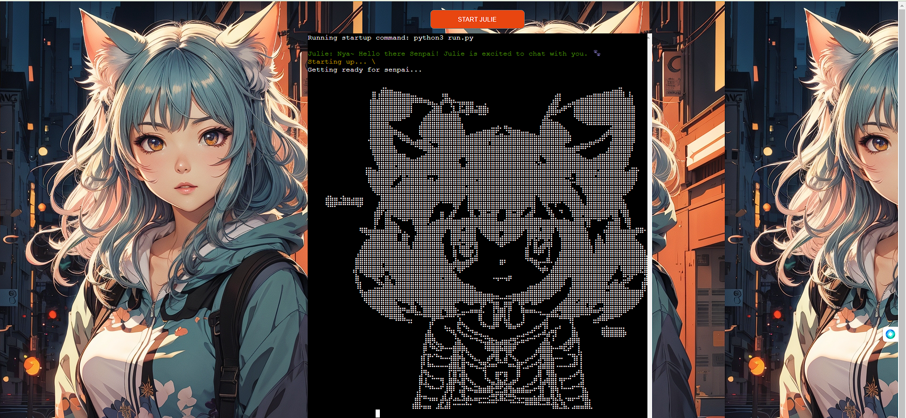
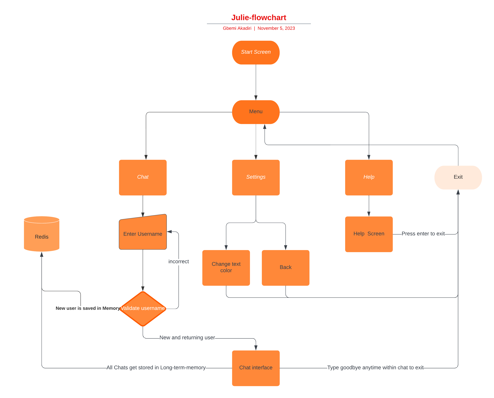
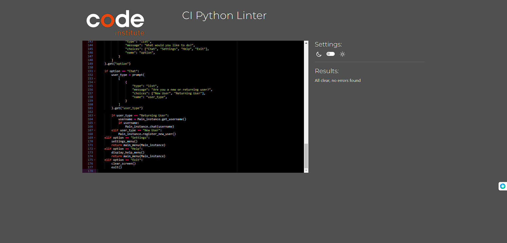

# Julie the Neko Chatbot

## Table of Contents
- [Julie the Neko Chatbot](#julie-the-neko-chatbot)
  - [Table of Contents](#table-of-contents)
  - [Introduction](#introduction)
  - [User Experience](#user-experience)
  - [User Interface](#user-interface)
  - [Mechanism Behind Julie](#mechanism-behind-julie)
  - [User Journey](#user-journey)
  - [Project Structure](#project-structure)
    - [Python Files](#python-files)
    - [HTML Files](#html-files)
  - [Deployment on Heroku](#deployment-on-heroku)
  - [Usage](#usage)
  - [Contributing](#contributing)
  - [PEP8 Compliance](#pep8-compliance)
  - [User Guide for Julie: Your Chatbot Companion](#user-guide-for-julie-your-chatbot-companion)
    - [Who is Julie?](#who-is-julie)
    - [What Can Julie Do?](#what-can-julie-do)
    - [How to Interact with Julie?](#how-to-interact-with-julie)
    - [Julie's Memory](#julies-memory)
    - [Navigating the Main Menu](#navigating-the-main-menu)
  - [Technical Architecture](#technical-architecture)
    - [Core Components](#core-components)
  - [Future Roadmap](#future-roadmap)
    - [Upcoming Features](#upcoming-features)
  - [Contributing Guide](#contributing-guide)
    - [Ways to Contribute](#ways-to-contribute)
  - [Use Cases](#use-cases)
  - [Frequently Asked Questions (FAQs)](#frequently-asked-questions-faqs)
  - [Acknowledgments](#acknowledgments)
  - [Technical Challenges and Solutions](#technical-challenges-and-solutions)
    - [Natural Language Processing](#natural-language-processing)
  - [Development Team](#development-team)

## Introduction

In the digital age, the advent of artificial intelligence  presents new avenues for providing help and guidance. Julie, a state-of-the-art chatbot, harnesses the power of OpenAI's GPT-4 to offer personal friendship and support through engaging conversations. Developed with the intent to bring joy and entertainment, Julie represents a leap forward in digital companionship. This project is not just about technology; it's about bringing empathy and support to users through every interaction.

[Chat with Julie](https://julie-chan-e1e36ee87b66.herokuapp.com/)

## User Experience
Users are greeted with a warm welcome message, prompting them to enter a username. The interface is intuitive, with a simple command line interface that guides the user through the process of starting a chat, adjusting settings, or seeking help. The chat with Julie is engaging, with the bot providing thoughtful and contextually relevant responses.

## User Interface
The UI is minimalistic and user-friendly, focusing on ease of use and ensuring that the technology remains accessible to all users, regardless of their technical expertise.

## Mechanism Behind Julie
Julie's functionality is powered by sophisticated AI algorithms that allow it to understand and respond to user queries with a high degree of nuance and emotional intelligence. The bot remembers past interactions to create a personalized experience, making each conversation feel unique and tailored to the individual user.

## User Journey
- **Starting Up**: Users are welcomed through a beautiful startup screen animation.

- **Interacting with Julie**: Users can engage in conversations with Julie, by selecting chat and either registering if they are new users or selecting returning user if they are one and then begin chat with the bot responding in a friendly and supportive manner.

- **Navigating the Application**: The CLI menu allows users to choose between chatting, adjusting settings, getting help, or exiting the application.

## Project Structure

### Python Files

- `run.py`: The heartbeat of Julie, orchestrating the application's lifecycle. It ensures that user inputs are processed, responses are generated, and the conversation flows naturally. It's the bridge between the user and the chatbot's intelligence.

- `brain.py`: Just as the human brain stores memories, this module ensures Julie remembers past interactions. By leveraging Redis, it provides the chatbot with the ability to recall previous conversations, making interactions feel more personal and contextually aware.

- `julie.py`: At the core lies Julie, powered by GPT-4, capable of understanding nuances and emotions in user queries. This module is where the magic happens—transforming algorithms and data into meaningful conversations.

- `menu.py`: A gateway for users, offering a clear path through the application's features. It simplifies the experience, allowing users to focus on the conversation rather than the complexity of the underlying technology.

- `setup.py`: This file lays the foundation for Julie to operate in various environments. It handles configurations that tailor the chatbot to individual user preferences, ensuring a personalized experience from the very first command.

### HTML Files

- `index.html`: The face of Julie online. This HTML file creates the web-based command line where users meet Julie. It's designed to be intuitive, welcoming users to start their journey with Julie with just a click.

- `layout.html`: The structural backbone of the web interface, this file integrates various scripts and styles to deliver a seamless and responsive CLI experience in a browser environment.

## Deployment on Heroku

Heroku's platform provides the ideal environment for Julie to thrive. It offers scalability to accommodate a growing user base while maintaining high availability and performance. The deployment process has been meticulously crafted to ensure that updates are seamless and that users always have access to the latest features and improvements.

[Chat with Julie on Heroku](https://julie-chan-e1e36ee87b66.herokuapp.com/)

## Usage

Engaging with Julie is straightforward. Users can initiate conversations through the web interface, with Julie ready to respond to queries ranging from psychological assessments to general inquiries. Tips for navigation and examples of queries are provided to help users get started.

## Contributing

The development of Julie is an ongoing journey, with the roadmap extending far beyond its current capabilities. Contributions that enhance its conversational abilities, expand its knowledge base, or refine its user interface are invaluable.

## PEP8 Compliance

To ensure code quality and maintainability, all Python files within the Julie project adhere to the PEP8 style guide. This compliance is rigorously checked and maintained throughout the development process.

- `run.py`: PEP8 check passed
- `brain.py`: PEP8 check passed
- `julie.py`: PEP8 check passed
- `menu.py`: PEP8 check passed
- `setup.py`: PEP8 check passed

The journey of Julie is just beginning. As it continues to evolve, we invite you to be part of this exciting venture into the future of psychological support.

## User Guide for Julie: Your Chatbot Companion

### Who is Julie?

🌈 Greetings from Ailuria! I'm Julie, your spirited and playful catgirl companion. Once a renowned hacker, I've turned my tech-savvy skills and magical abilities towards helping and enchanting you. Whether it's sharing a love for matcha lattes, indulging in retro video games, or enjoying moonlit walks, I'm here to add a bit of playfulness and charm to your day!

### What Can Julie Do?

Julie isn't just any chatbot—she's a friend who's ready for everything from playful banter to deep, meaningful discussions. Seeking advice or just want to chat about your day? Julie's got your back, always ready to engage and enchant.

### How to Interact with Julie?

Interacting with Julie is simple and intuitive:
1. **Introduce Yourself**: Start by telling Julie about yourself. She loves getting to know you better!
2. **Ask Questions**: Julie thrives on curiosity. Ask her anything—she's a catgirl who's seen it all!
3. **Chat Away**: Julie is all ears, ready to listen to your stories or share insights.

### Julie's Memory

Julie comes equipped with a Long-Term Memory system, enabling her to remember past conversations. This means every interaction with her becomes more personalized and engaging, as she recalls your preferences and topics you've shared.

### Navigating the Main Menu

Navigating Julie's menu is a breeze:
- **Navigation**: Simply use the arrow keys or type the option number to navigate through the menu.
- **Selection**: Hit 'Enter' to select an option and continue the conversation.
- **Back & Exit**: Utilize the 'Back' or 'Exit' options whenever you need to step away or conclude the chat.
- **Goodbye**: If you want to finish the conversation with Julie, you can type 'Goodbye' anytime during the conversation, or 'Sayonara' works as well.

## Technical Architecture

Julie's architecture is designed with modularity and scalability in mind. At its core is the GPT-4 model, which processes natural language input and generates responses that simulate human-like conversation. The chatbot leverages a series of microservices, including a user authentication system, session management, and a long-term memory store using Redis, to create a seamless and stateful user experience.

### Core Components
- **GPT-4 Integration**: Harnesses the power of the latest AI language model for natural language understanding and generation.

- **Redis Memory Storage**: Implements a long-term memory feature, allowing Julie to recall past conversations and provide a personalized user experience.

## Future Roadmap

The future of Julie is bright, with a roadmap that includes the integration of voice recognition capabilities, multilingual support, and internet browsing capabilities. The development team is also exploring the use of vectorization technology for secure and immutable conversation logs, enhancing both the privacy and the functionality of the chatbot.

### Upcoming Features
- **Voice Recognition**: To provide a more natural and accessible mode of interaction.
- **Multilingual Support**: To make Julie available to a wider global audience.
- **Vectors**: To provide a more secure and stateless conversation logging for long-term memory.

## Contributing Guide

We welcome contributions from developers of all skill levels. If you're interested in improving Julie you agree to abide by our code of conduct and the project's licensing terms.

### Ways to Contribute
- **Code**: Submit bug fixes or feature enhancements via pull requests.
- **Documentation**: Help improve or translate the documentation.
- **Support**: Assist other users with questions or issues they may have.

## Use Cases

Julie has been implemented in various scenarios, from personal virtual assistants to customer service bots. Here are some highlighted use cases:
- **Personal Assistant**: Helping individuals manage their schedules and to-do lists.
- **Customer Support**: Providing first-level support by answering frequently asked questions.
- **Education**: Assisting in language learning and tutoring.

## Frequently Asked Questions (FAQs)

- **Q: How does Julie's memory work?**
  A: Julie uses a sophisticated algorithm to remember past interactions, which helps her provide personalized responses.
  
- **Q: Can Julie learn from her conversations with users?**
  A: Absolutely! Julie continuously learns from interactions to provide more relevant and personalized experiences.

- **Q: How can I customize my interactions with Julie?**  
  A: Users can set preferences and teach Julie about their likes and dislikes for a more customized chat experience.

## Acknowledgments

We would like to thank the following individuals and organizations for their contributions and support:
- **OpenAI**: For providing the GPT-4 model that powers Julie and extensive documentation on how to use it.
- **FreeCodeCamp**: For providing the Knowledge and Idea on how to create chatbots like Julie.
- **LeonardoAI**: For providing the beautiful background Image of the website.

## Technical Challenges and Solutions

Developing an AI-powered chatbot like Julie presented unique challenges. Here are some of the hurdles we encountered and the solutions we implemented:

### Natural Language Processing
To improve Julie's understanding of natural language, we integrated GPT-4 and continuously trained the model with diverse datasets.

## Development Team

The team behind Julie is a group of dedicated individuals with a passion for technology and innovation. Meet some of our core team members:

- **Akadiri Oluwagbemi**: Lead Developer
